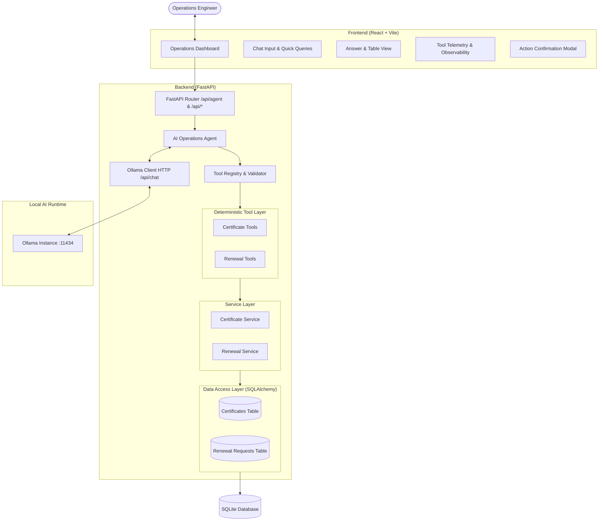
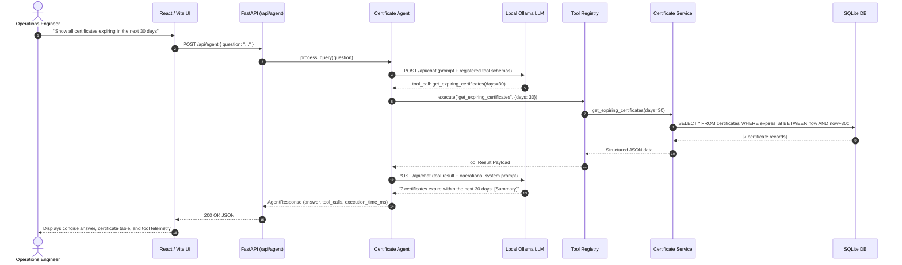
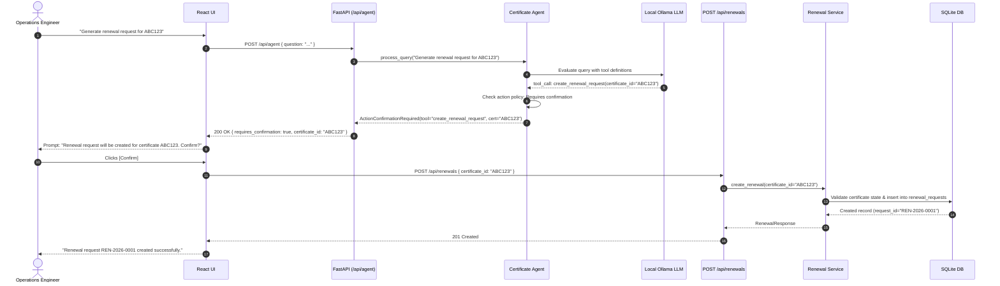
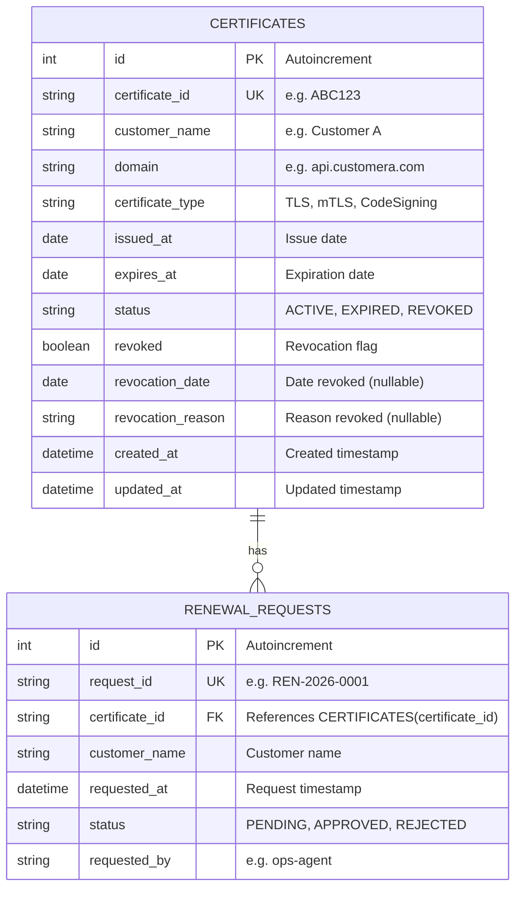

# AI Operations Agent for Enterprise Certificates — Project Plan

## 1. Executive Summary & Business Problem

Enterprises operate complex hybrid and multi-cloud infrastructures where thousands of digital certificates (TLS/SSL, mTLS, code signing, and device identity certificates) safeguard application communication and perimeter security. Operations and Site Reliability Engineering (SRE) teams face critical operational bottlenecks:

- **Operational Overhead:** Teams expend significant engineering hours manually checking validity, verifying certificate revocation lists (CRLs/OCSP), looking up issuer details, and identifying expiring certificates across disparate systems.
- **Outage Risks:** Unplanned certificate expirations cause severe production outages, customer trust erosion, and compliance violations.
- **Workflow Inefficiencies:** Raising renewal tickets manually requires multiple verification steps (checking whether the certificate is already revoked, whether an existing renewal request is active, and whether the certificate is within the valid renewal window).
- **Goal:** Build an **AI Operations Agent** that understands operational queries in natural language, autonomously selects and executes backend tools against a deterministic database, presents structured answers, and safely handles action execution (such as certificate renewals) through two-phase confirmation.

---

## 2. Functional Requirements

1. **Natural Language Understanding & Tool Calling:**
   - The AI agent must parse user intent via a local Ollama LLM and select appropriate tools using structured tool/function calling.
   - No hardcoded string-matching or heuristic routing (`if "revoked" in text`).
   - The LLM must not receive direct SQL access.

2. **Core Certificate Operations (Tools):**
   - `get_certificate(certificate_id: str)`: Retrieve comprehensive details of a certificate (domain, customer, validity dates, status, revocation details).
   - `get_expiring_certificates(days: int)`: Identify active certificates expiring within $N$ days relative to the current operational date.
   - `get_certificates_expiring_between(start_date: str, end_date: str)`: Query certificates expiring within an exact calendar date range (e.g., "next month").
   - `check_revocation(certificate_id: str)`: Determine revocation status, revocation timestamp, and revocation reason.
   - `get_customer_certificates(customer_name: str)`: Retrieve all certificates associated with a specific customer or tenant.
   - `create_renewal_request(certificate_id: str)`: Action tool validating certificate state and queuing a renewal request.

3. **Safe Action Execution (Human-in-the-Loop Confirmation):**
   - Destructive or state-changing actions (such as generating renewal requests) must require explicit user confirmation.
   - The agent detects the intent, validates feasibility, and requests confirmation from the user in the UI before persisting the renewal record.

4. **REST APIs & Backend Services:**
   - Agent interaction endpoint (`POST /api/agent`).
   - Standard REST endpoints for direct UI/debugging access:
     - `GET /health` (Ollama & Database readiness)
     - `GET /api/certificates/{certificate_id}`
     - `GET /api/certificates/expiring?days=30`
     - `GET /api/certificates/customer/{customer_name}`
     - `GET /api/certificates/{certificate_id}/revocation`
     - `POST /api/renewals`

5. **Enterprise Operations Frontend:**
   - Interactive question input with pre-configured quick demo queries.
   - Clear AI response panel with markdown and formatted certificate cards/tables.
   - Full observability widget: tool invoked, input arguments, result summary, and execution duration in milliseconds.
   - Interactive confirmation dialog for renewal generation.

---

## 3. Non-Functional Requirements

- **Privacy & Zero Cost:** Completely local AI execution using Ollama. No external paid APIs (no OpenAI, Gemini, or Anthropic keys required).
- **Anti-Hallucination:** All factual certificate records, expiration dates, customer names, and revocation flags must originate exclusively from the deterministic service layer. The LLM acts solely as an orchestrator and summarizer.
- **Portability:** Built on SQLAlchemy with SQLite as the default zero-config store, architected for immediate drop-in transition to PostgreSQL.
- **Performance:** Sub-second deterministic tool queries; end-to-end agent response times bounded primarily by local LLM inference speed.
- **Security:** Strict Pydantic input/output validation; parameterized ORM queries; configurable CORS origins.
- **Observability:** Structured logging with timestamp, request ID, question, selected tool, execution duration, and outcome.

---

## 4. System Architecture

The application adopts a clean, layered architecture separating user interface, API routing, agent orchestration, deterministic tools, service logic, and database access.



---

## 5. Agent Architecture & Execution Flow

The agent operates in a closed-loop tool-execution model:



### Action Confirmation Sequence (Renewals)



---

## 6. Database Design



### Table Specifications

#### 1. `certificates` Table
- `id`: Integer, Primary Key, Autoincrement.
- `certificate_id`: VARCHAR(64), Unique, Indexed, Not Null.
- `customer_name`: VARCHAR(128), Indexed, Not Null.
- `domain`: VARCHAR(255), Indexed, Not Null.
- `certificate_type`: VARCHAR(32), Default 'TLS', Not Null.
- `issued_at`: DATE, Not Null.
- `expires_at`: DATE, Indexed, Not Null.
- `status`: VARCHAR(32), Not Null (Values: `ACTIVE`, `EXPIRED`, `REVOKED`).
- `revoked`: BOOLEAN, Default `FALSE`, Indexed, Not Null.
- `revocation_date`: DATE, Nullable.
- `revocation_reason`: VARCHAR(255), Nullable.
- `created_at`: DATETIME, UTC default.
- `updated_at`: DATETIME, UTC default with auto-update.

#### 2. `renewal_requests` Table
- `id`: Integer, Primary Key, Autoincrement.
- `request_id`: VARCHAR(64), Unique, Indexed, Not Null.
- `certificate_id`: VARCHAR(64), ForeignKey(`certificates.certificate_id`), Not Null.
- `customer_name`: VARCHAR(128), Not Null.
- `requested_at`: DATETIME, UTC default, Not Null.
- `status`: VARCHAR(32), Default 'PENDING', Not Null.
- `requested_by`: VARCHAR(128), Default 'ops-agent', Not Null.

---

## 7. API Design

### 1. `GET /health`
- **Description:** Health check verifying database and local Ollama readiness.
- **Response:**
  ```json
  {
    "status": "ok",
    "ollama": "available",
    "database": "available",
    "model": "llama3.2:latest"
  }
  ```

### 2. `POST /api/agent`
- **Description:** Natural language endpoint for operational queries.
- **Request Body:**
  ```json
  {
    "question": "Show all certificates expiring in the next 30 days"
  }
  ```
- **Response Body:**
  ```json
  {
    "answer": "7 certificates expire within the next 30 days.",
    "tool_calls": [
      {
        "tool_name": "get_expiring_certificates",
        "arguments": { "days": 30 },
        "result_summary": "Found 7 certificates expiring within 30 days",
        "success": true
      }
    ],
    "records": [ ... ],
    "execution_time_ms": 1180,
    "action_required": null
  }
  ```
- **Action Confirmation Response Body (if action tool detected):**
  ```json
  {
    "answer": "Renewal request can be generated for certificate ABC123. Please confirm to proceed.",
    "tool_calls": [
      {
        "tool_name": "create_renewal_request",
        "arguments": { "certificate_id": "ABC123" },
        "result_summary": "Action requires user confirmation",
        "success": true
      }
    ],
    "action_required": {
      "action_type": "CREATE_RENEWAL",
      "certificate_id": "ABC123",
      "customer_name": "Customer A",
      "description": "Renewal request will be created for certificate ABC123."
    },
    "execution_time_ms": 620
  }
  ```

### 3. Direct REST Endpoints
- `GET /api/certificates/{certificate_id}`: Returns single certificate details or 404.
- `GET /api/certificates/expiring?days=30`: Returns certificates expiring within $N$ days.
- `GET /api/certificates/customer/{customer_name}`: Returns all certificates for given customer.
- `GET /api/certificates/{certificate_id}/revocation`: Returns revocation status.
- `POST /api/renewals`: Creates renewal request given `{ "certificate_id": "ABC123", "requested_by": "ops-agent" }`.

---

## 8. Tool Definitions

| Tool Name | Parameters | Purpose | Return Structure |
| :--- | :--- | :--- | :--- |
| `get_certificate` | `certificate_id: str` | Fetch complete certificate profile | `{certificate_id, customer_name, domain, certificate_type, issued_at, expires_at, status, revoked, revocation_date, revocation_reason}` |
| `get_expiring_certificates` | `days: int` | Find active certificates expiring within $N$ days | `[{certificate_id, customer_name, domain, expires_at, status, days_remaining}]` |
| `get_certificates_expiring_between` | `start_date: str`, `end_date: str` | Find certificates expiring within exact date range | `[{certificate_id, customer_name, domain, expires_at, status, days_remaining}]` |
| `check_revocation` | `certificate_id: str` | Check revocation status and reason | `{certificate_id, revoked, revocation_date, revocation_reason, status}` |
| `get_customer_certificates` | `customer_name: str` | Fetch all certificates for customer | `[{certificate_id, domain, certificate_type, status, expires_at}]` |
| `create_renewal_request` | `certificate_id: str` | Validate and initiate renewal request | `{request_id, certificate_id, customer_name, status, requested_at}` |

---

## 9. UI Design & User Experience

- **Theme & Aesthetics:** Modern dark/light enterprise operations theme (slate/indigo palette, clean typography, border radiuses, glassmorphism cards).
- **Header:** Title, branding badge, and real-time backend/Ollama/DB status indicators.
- **Quick Action Chips:** Clickable pills for the 5 demo queries:
  1. *"Show certificates expiring in the next 30 days"*
  2. *"Show certificates expiring next month"*
  3. *"Check certificate ABC123 status"*
  4. *"Is certificate XYZ789 revoked?"*
  5. *"Generate renewal request for ABC123"*
  6. *"List certificates belonging to Customer A"*
- **Chat Input Bar:** Full-width input with `Ask Agent`, loading state spinner, and clear/reset button.
- **Results View:**
  - **Operational Answer Card:** Natural language operational summary synthesized by LLM.
  - **Data Table / Card Grid:** Formatted table displaying matched certificates with status pills (`ACTIVE`, `EXPIRED`, `REVOKED`) and days remaining counters.
  - **Tool Telemetry Bar:** Collapsible inspection drawer showing tool name, arguments, result summary, and execution duration.
  - **Action Confirmation Dialog:** Prominent banner/modal with `[Confirm Renewal]` and `[Cancel]` buttons when action confirmation is required.

---

## 10. Error Handling Strategy

1. **Service-Level Exceptions:**
   - `CertificateNotFoundError`: Maps to HTTP 404 or concise message `"Certificate <ID> was not found."`
   - `RevocationConflictError`: Triggered when attempting renewal on revoked cert (`"Certificate <ID> is revoked and cannot be renewed."`)
   - `RenewalConflictError`: Triggered when an active renewal exists (`"An active renewal request already exists for <ID>."`)
   - `ExpiredCertificateError`: Handled per business policy with clear diagnostic output.
2. **AI & Infrastructure Failures:**
   - If Ollama is offline: Returns structured fallback response: `"AI service is unavailable. Please ensure Ollama is running."`
   - If model output fails schema validation: Reprompts or returns a clean fallback error without leaking stack traces.
3. **Frontend Resilience:**
   - Displays user-friendly error banners with actionable guidance.
   - Preserves state and input query for easy retry.

---

## 11. Testing Strategy

1. **Unit Tests (Backend Services & Tools):**
   - Query existing certificate (`ABC123`).
   - Query non-existent certificate (`INVALID999`).
   - Test expiring certificates logic with dynamic dates.
   - Test customer certificates filter (`Customer A`).
   - Test revocation check for revoked cert (`XYZ789`) and active cert.
   - Test renewal creation, duplicate prevention, and revoked certificate blocking.
2. **API Tests:**
   - Test `/health` endpoint.
   - Test `/api/certificates/*` and `/api/renewals` endpoints.
   - Test `/api/agent` endpoint using a mocked Ollama client to guarantee deterministic automated CI/CD runs.
3. **End-to-End Verification:**
   - Execute all 5 demo scenarios with the live local Ollama instance (`llama3.2:latest`).
   - Validate UI rendering and action confirmation flow.
