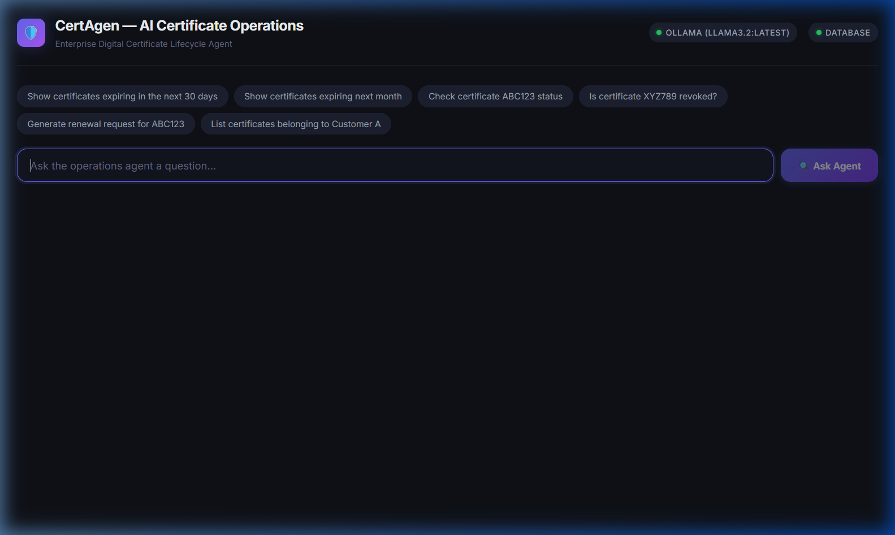
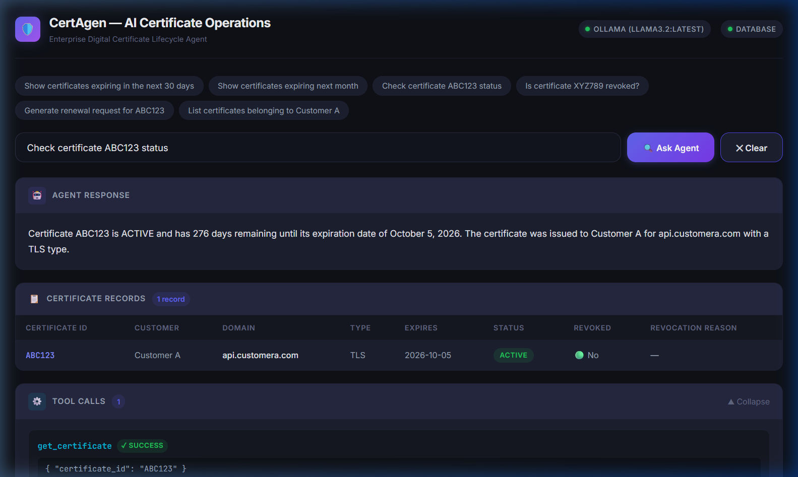
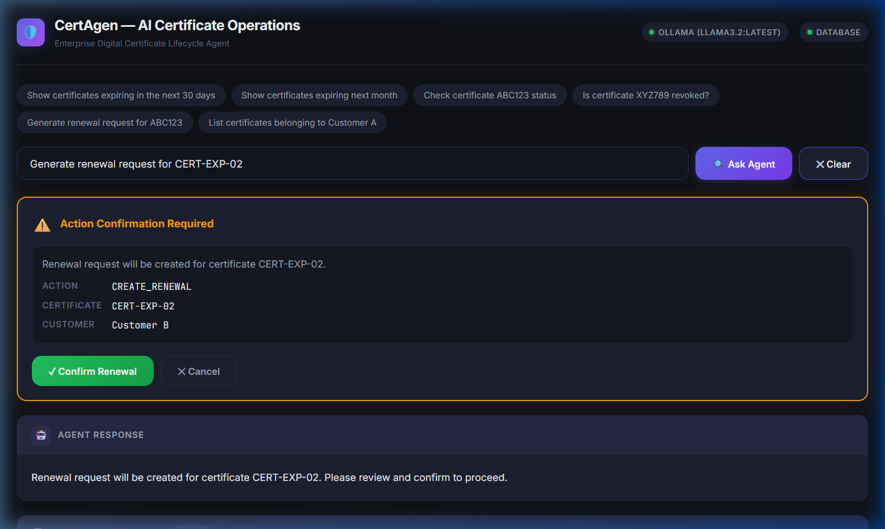
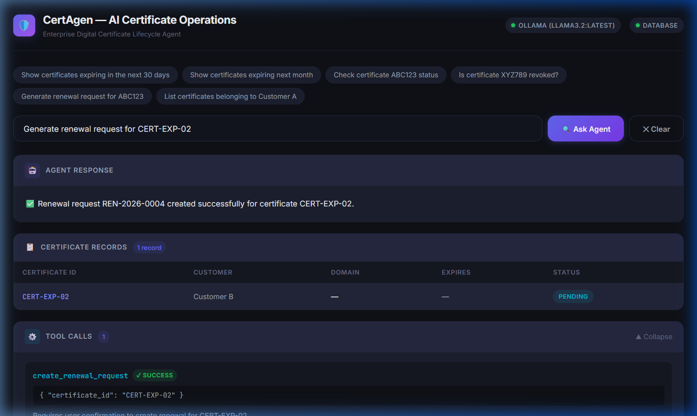
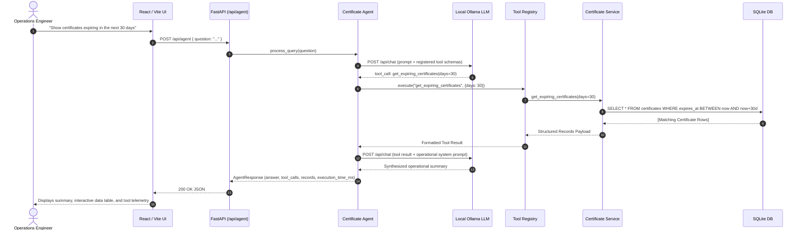

# 🛡️ CertAgen — AI Operations Agent for Enterprise Certificates

<div align="center">


-white?style=for-the-badge&logo=ollama&logoColor=black)


<p align="center">
  <b>A production-grade, privacy-preserving AI Operations Agent for enterprise digital certificate lifecycle management.</b><br>
  Understands natural language queries, autonomously selects and executes deterministic database tools via local LLM function calling, guarantees zero hallucination of operational facts, and enforces strict human-in-the-loop confirmation for destructive or state-changing actions.
</p>

</div>

---

## 📑 Table of Contents

- [Executive Summary & Problem Statement](#-executive-summary--problem-statement)
- [Application Screenshots & UI Tour](#-application-screenshots--ui-tour)
- [Key Features & Architectural Tenets](#-key-features--architectural-tenets)
- [System Architecture](#-system-architecture)
- [Deterministic Tool Registry](#-deterministic-tool-registry)
- [Two-Phase Action Execution (Human-in-the-Loop)](#-two-phase-action-execution-human-in-the-loop)
- [Technology Stack](#-technology-stack)
- [Repository Structure](#-repository-structure)
- [Quick Start Guide](#-quick-start-guide)
- [API Reference](#-api-reference)
- [Automated Testing Suite](#-automated-testing-suite)
- [Interactive Demo Scenarios](#-interactive-demo-scenarios)
- [License](#-license)

---

## 🏢 Executive Summary & Problem Statement

Enterprises operate complex hybrid and multi-cloud infrastructures where thousands of digital certificates (TLS/SSL, mTLS, code signing, and device identity certificates) safeguard internal microservices and perimeter ingress. Operations, SRE, and Security teams face critical bottlenecks:

- **High Operational Overhead:** Engineers spend significant hours manually querying certificate validity, cross-referencing expiration windows, verifying Certificate Revocation Lists (CRL/OCSP), and mapping tenant ownership.
- **Outage Risks:** Unplanned certificate expirations trigger severe production outages, broken service meshes, and customer trust loss.
- **Workflow Inefficiencies & Drift:** Generating renewal requests manually without verifying current revocation status or duplicate pending tickets introduces conflicting requests.

**CertAgen solves this with a localized, privacy-first AI Operations Agent.** The agent interprets natural language queries, maps them to deterministic backend tools against SQLite/PostgreSQL, formats real operational data, and prevents accidental operations via explicit confirmation modals.

---

## 🖼️ Application Screenshots & UI Tour

### 1. Operations Dashboard Overview
The CertAgen dashboard features a sleek enterprise dark theme with real-time connectivity indicators for the local Ollama LLM and the database, accompanied by pre-configured operational quick chips.

<div align="center">
  
  <p><i>Figure 1: Clean desktop operations dashboard with live status pills (Ollama llama3.2 & Database) and quick query chips.</i></p>
</div>

---

### 2. Natural Language Query & Deterministic Retrieval
When an operator queries certificate metadata (e.g. *"Check certificate ABC123 status"*), the agent selects the exact tool, queries the database, and returns both an AI-synthesized operational summary and a structured data table with complete telemetry.

<div align="center">
  
  <p><i>Figure 2: Natural language response, structured record table with status badges, and collapsible tool execution telemetry.</i></p>
</div>

---

### 3. Two-Phase Action Confirmation Modal (Human-in-the-Loop)
When an operator requests a state-changing action (e.g. *"Generate renewal request for CERT-EXP-02"*), CertAgen intercepts the action tool (`is_action=True`), validates preconditions, and pauses execution with an explicit confirmation dialog.

<div align="center">
  
  <p><i>Figure 3: High-visibility confirmation banner preventing unauthorized or accidental state mutations.</i></p>
</div>

---

### 4. Verified Action Completion
Upon explicit operator approval by clicking **"✓ Confirm Renewal"**, the renewal record is securely committed to the database, assigning a permanent tracking ID (`REN-2026-0004`) and updating operational status.

<div align="center">
  
  <p><i>Figure 4: Confirmed renewal execution showing generated tracking identifier and pending renewal record.</i></p>
</div>

---

## ⚡ Key Features & Architectural Tenets

| Tenet | Implementation |
| :--- | :--- |
| **🔒 100% Local & Zero Cost** | Powered by **Ollama (`llama3.2:latest`)**. No external API keys, no subscription costs, and no sensitive infrastructure metadata leaves the perimeter. |
| **🎯 Zero Hallucination** | Operational data (domains, dates, revocation flags) is retrieved exclusively via deterministic SQLAlchemy queries. The LLM acts solely as a semantic parser and conversational summarizer. |
| **🛡️ Safe Action Execution** | Destructive and state-changing actions require explicit two-phase human confirmation via the UI modal before committing. |
| **📊 Full Observability** | Every interaction logs the selected tool, parameter inputs, database record counts, and execution latency in milliseconds. |
| **🔄 Database Portability** | Built with SQLAlchemy 2.0 ORM; defaults to zero-configuration SQLite for local dev and seamlessly swaps to PostgreSQL for enterprise production. |

---

## 🏗️ System Architecture

### Agent Closed-Loop Execution Flow



---

## 🛠️ Deterministic Tool Registry

CertAgen exposes deterministic Python tools registered in `backend/app/tools/registry.py`:

| Tool Name | Parameters | Safety Tier | Description |
| :--- | :--- | :---: | :--- |
| `get_certificate` | `certificate_id: str` | 🟢 Read-Only | Retrieves comprehensive certificate metadata by ID. |
| `get_expiring_certificates` | `days: int` | 🟢 Read-Only | Identifies active certificates expiring within $N$ days. |
| `get_certificates_expiring_between` | `start_date: str`, `end_date: str` | 🟢 Read-Only | Queries certificates expiring within a date range (e.g. next month). |
| `check_revocation` | `certificate_id: str` | 🟢 Read-Only | Verifies whether a certificate is revoked, revocation date, and reason. |
| `get_customer_certificates` | `customer_name: str` | 🟢 Read-Only | Retrieves all certificates belonging to a specific customer/tenant. |
| `create_renewal_request` | `certificate_id: str` | 🟡 **Action (Confirm)** | Validates state and queues a renewal request. |

---

## 🔐 Two-Phase Action Execution (Human-in-the-Loop)

CertAgen implements a strict safety policy for operations that mutate state:

```
[User Request: "Generate renewal request for CERT-EXP-02"]
       │
       ▼
[Ollama Tool Call: create_renewal_request]
       │
       ▼
[Agent Intercept: is_action == True]
       │
       ├──► 1. Pre-flight Validation (Check existence, revocation status, duplicate renewals)
       │
       ▼
[Return Action Required: { action_type: "CREATE_RENEWAL", certificate_id: "CERT-EXP-02" }]
       │
       ▼
[Frontend UI: Displays Action Confirmation Modal]
       │
       ├── [Cancel] ──► Action aborted without DB modification
       │
       └── [Confirm Renewal] ──► POST /api/renewals ──► Persist Record & Return ID
```

---

## 💻 Technology Stack

### Backend
- **Framework:** Python 3.11+ / FastAPI (Async ASGI)
- **Data Validation:** Pydantic v2
- **ORM & Database:** SQLAlchemy 2.0 with SQLite (zero-config local) / PostgreSQL support
- **Local AI:** Ollama Client communicating with `llama3.2:latest`

### Frontend
- **Framework:** React 18 with Vite 5
- **Styling:** Vanilla CSS Custom Design System (dark enterprise theme, responsive layout, glassmorphic cards)
- **State Management:** React hooks (`useState`, `useCallback`, `useEffect`)

---

## 📂 Repository Structure

```
CertAgen/
├── docs/
│   └── screenshots/                   # Application screenshots
│       ├── 01_homepage_overview.png
│       ├── 02_certificate_query_result.png
│       ├── 03_action_confirmation_modal.png
│       └── 04_renewal_confirmed_result.png
│
├── backend/
│   ├── app/
│   │   ├── agent/
│   │   │   ├── agent.py               # AI Agent orchestrator & confirmation handler
│   │   │   ├── ollama_client.py       # Ollama chat & tool schema client
│   │   │   └── prompts.py             # System & operational prompt definitions
│   │   ├── api/
│   │   │   ├── agent_router.py        # POST /api/agent endpoint
│   │   │   ├── certificate_router.py  # GET /api/certificates/* endpoints
│   │   │   ├── renewal_router.py      # POST /api/renewals endpoint
│   │   │   └── __init__.py
│   │   ├── models/
│   │   │   ├── certificate.py         # Certificate SQLAlchemy model
│   │   │   └── renewal.py             # RenewalRequest SQLAlchemy model
│   │   ├── schemas/                   # Pydantic input/output schemas
│   │   ├── seed/
│   │   │   └── seed_data.py           # Enterprise certificate seed dataset
│   │   ├── services/
│   │   │   ├── certificate_service.py # Certificate query business logic
│   │   │   └── renewal_service.py     # Renewal business logic & safety checks
│   │   ├── tools/
│   │   │   ├── certificate_tools.py   # Deterministic tool implementations
│   │   │   └── registry.py            # Tool registry & schema generator
│   │   ├── utils/
│   │   │   └── logger.py              # Structured logging utility
│   │   ├── config.py                  # Environment & settings configuration
│   │   ├── database.py                # Database engine & session maker
│   │   └── main.py                    # FastAPI entry point & CORS configuration
│   ├── tests/
│   │   ├── test_agent_tools.py        # Tool registry & schema tests
│   │   ├── test_api.py                # REST API & mocked agent tests
│   │   ├── test_certificates.py       # Certificate query & filter tests
│   │   └── test_renewals.py           # Renewal lifecycle & conflict tests
│   ├── certificates.db                # SQLite database
│   ├── requirements.txt               # Backend dependencies
│   └── .env                           # Environment configuration
│
├── frontend/
│   ├── src/
│   │   ├── components/
│   │   │   ├── AnswerPanel.jsx        # AI answer card
│   │   │   ├── CertificateTable.jsx   # Formatted certificate table
│   │   │   ├── ChatInput.jsx          # Input bar + quick demo pills
│   │   │   ├── ErrorMessage.jsx       # Dismissible alert banner
│   │   │   ├── ExecutionTime.jsx      # Telemetry badge
│   │   │   ├── LoadingState.jsx       # Animated status spinner
│   │   │   └── ToolCalls.jsx          # Observability accordion
│   │   ├── services/
│   │   │   └── api.js                 # Frontend API client
│   │   ├── App.jsx                    # Root component & confirmation modal
│   │   ├── index.css                  # Dark enterprise design system CSS
│   │   └── main.jsx
│   ├── package.json
│   └── vite.config.js                 # Vite proxy configuration
│
├── PROJECT_PLAN.md                    # Formal architecture specification
└── README.md                          # Project documentation
```

---

## 🚀 Quick Start Guide

### Prerequisites
1. **Python 3.11+** installed
2. **Node.js 18+** installed
3. **Ollama** installed with `llama3.2` model:
   ```bash
   ollama pull llama3.2
   ollama serve
   ```

### 1. Backend Setup

```bash
cd backend

# Install Python dependencies
pip install -r requirements.txt

# Seed the database with enterprise sample certificates
python -m app.seed.seed_data

# Launch the FastAPI backend server
python -m uvicorn app.main:app --host 127.0.0.1 --port 8000 --reload
```

The backend will start at `http://127.0.0.1:8000`. You can inspect interactive OpenAPI documentation at `http://127.0.0.1:8000/docs`.

### 2. Frontend Setup

In a new terminal:
```bash
cd frontend

# Install npm dependencies
npm install

# Start the Vite development server
npm run dev
```

Open your browser to `http://localhost:5173/`.

---

## 📡 API Reference

### Health Check
- **`GET /health`**
  ```json
  {
    "status": "ok",
    "ollama": "available",
    "database": "available",
    "model": "llama3.2:latest",
    "details": {
      "model_ready": true,
      "ollama_info": "connected"
    }
  }
  ```

### AI Agent Endpoint
- **`POST /api/agent`**
  - **Request Body:** `{"question": "Show certificates expiring in the next 30 days"}`
  - **Response Body:**
    ```json
    {
      "answer": "Found 10 certificates expiring in the next 30 days...",
      "tool_calls": [
        {
          "tool_name": "get_expiring_certificates",
          "arguments": { "days": "30" },
          "result_summary": "Found 10 certificate(s) expiring within 30 days.",
          "success": true
        }
      ],
      "records": [ ... ],
      "execution_time_ms": 1150,
      "action_required": null
    }
    ```

### Direct Certificate Endpoints
- **`GET /api/certificates/{certificate_id}`** — Retrieve metadata for a specific certificate.
- **`GET /api/certificates/expiring?days=30`** — List certificates expiring within $N$ days.
- **`GET /api/certificates/customer/{customer_name}`** — List certificates for a customer.
- **`GET /api/certificates/{certificate_id}/revocation`** — Check revocation status and reason.
- **`POST /api/renewals`** — Create a renewal request (`{"certificate_id": "ABC123", "requested_by": "ops-agent"}`).

---

## 🧪 Automated Testing Suite

The backend contains a test suite covering service business logic, edge conditions, revocation checks, and mocked agent routing:

```bash
cd backend
python -m pytest -v
```

```
============================= test session starts =============================
platform win32 -- Python 3.14.6, pytest-9.1.1, pluggy-1.6.0
rootdir: C:\Users\abishek\Desktop\CertAgen\backend
collected 18 items

tests/test_agent_tools.py::test_tool_registry_contains_required_tools PASSED [  5%]
tests/test_agent_tools.py::test_ollama_tool_schemas PASSED               [ 11%]
tests/test_agent_tools.py::test_reject_unregistered_tool PASSED          [ 16%]
tests/test_agent_tools.py::test_action_tool_flag PASSED                  [ 22%]
tests/test_api.py::test_health_endpoint PASSED                           [ 27%]
tests/test_api.py::test_get_certificate_api PASSED                       [ 33%]
tests/test_api.py::test_get_expiring_certificates_api PASSED             [ 38%]
tests/test_api.py::test_create_renewal_api PASSED                        [ 44%]
tests/test_api.py::test_agent_api_with_mocked_ollama PASSED              [ 50%]
tests/test_certificates.py::test_get_existing_certificate PASSED         [ 55%]
tests/test_certificates.py::test_get_missing_certificate PASSED          [ 61%]
tests/test_certificates.py::test_get_expiring_certificates PASSED        [ 66%]
tests/test_certificates.py::test_customer_certificates PASSED            [ 72%]
tests/test_certificates.py::test_revocation_checks PASSED                [ 77%]
tests/test_renewals.py::test_create_valid_renewal PASSED                 [ 83%]
tests/test_renewals.py::test_prevent_duplicate_renewal PASSED            [ 88%]
tests/test_renewals.py::test_reject_renewal_for_revoked_cert PASSED      [ 94%]
tests/test_renewals.py::test_reject_renewal_for_missing_cert PASSED      [100%]

======================== 18 passed in 2.62s ========================
```

---

## 💡 Interactive Demo Scenarios

| # | Natural Language Query | Selected Tool | Expected Outcome |
| :-: | :--- | :--- | :--- |
| **1** | *"Show certificates expiring in the next 30 days"* | `get_expiring_certificates(days=30)` | Lists active expiring certs with remaining days count. |
| **2** | *"Show certificates expiring next month"* | `get_certificates_expiring_between(...)` | Filters certs expiring within the calendar boundaries. |
| **3** | *"Check certificate ABC123 status"* | `get_certificate(certificate_id='ABC123')` | Returns domain, tenant, validity status, and expiry date. |
| **4** | *"Is certificate XYZ789 revoked?"* | `check_revocation(certificate_id='XYZ789')` | Confirms revocation status, date, and revocation reason. |
| **5** | *"List certificates belonging to Customer A"* | `get_customer_certificates(customer_name='Customer A')` | Tenancy filtering isolating Customer A certificates. |
| **6** | *"Generate renewal request for CERT-EXP-02"* | `create_renewal_request(certificate_id='CERT-EXP-02')` | Pauses for **Action Confirmation Modal** before creating renewal. |

---

## 📄 License

This project is licensed under the MIT License — see the LICENSE file for details. Built for enterprise infrastructure and SRE operations.
