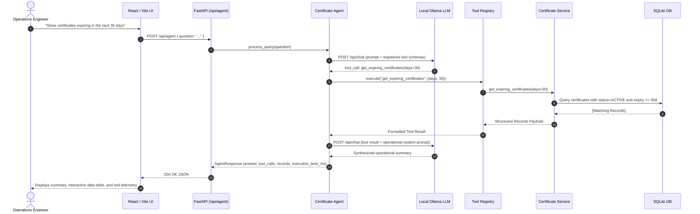
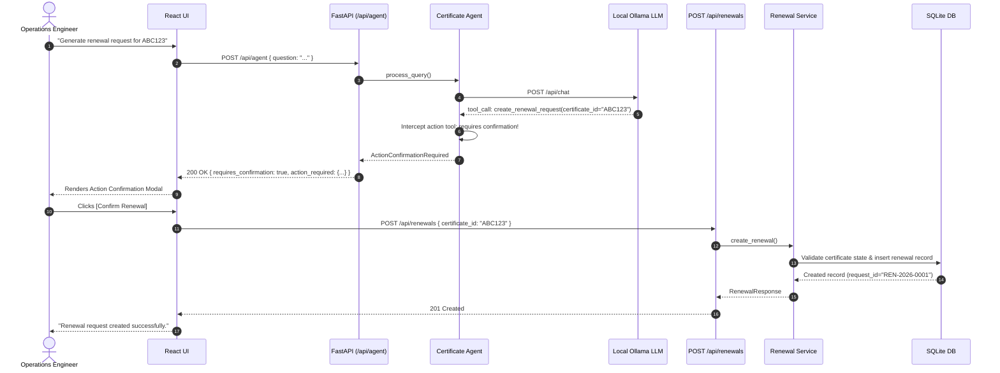

# CertAgen — AI Operations Agent for Enterprise Certificates

[](https://www.python.org/)
[](https://fastapi.tiangolo.com/)
[](https://react.dev/)
[](https://vitejs.dev/)
[-white.svg)](https://ollama.ai/)
[]()

> A production-grade, local AI Operations Agent for enterprise digital certificate lifecycle management. Understands natural language queries, executes deterministic database tools via local LLM function calling, guarantees zero hallucination of operational facts, and enforces human-in-the-loop confirmation for destructive or state-changing actions.

---

## 🌟 Table of Contents
- [CertAgen](#-problem--mission)
- [Key Features](#-key-features)
- [Architecture & Workflow](#-architecture--workflow)
- [Deterministic Tool Registry](#-deterministic-tool-registry)
- [Safety & Human-in-the-Loop Policies](#-safety--human-in-the-loop-policies)
- [Tech Stack](#-tech-stack)
- [Directory Structure](#-directory-structure)
- [Quick Start Guide](#-quick-start-guide)
- [API Reference](#-api-reference)
- [Automated Testing](#-automated-testing)
- [Sample Demo Scenarios](#-sample-demo-scenarios)

---

## 🏢 CertAgen Overview

Enterprises manage thousands of digital certificates across hybrid cloud clusters, internal microservices, external APIs, and IoT devices. Operations, Security, and SRE teams face:

1. **Massive Operational Overhead:** High time spent tracking down expiration dates, verifying Certificate Revocation Lists (CRL/OCSP), and checking tenant ownership.
2. **Outage Risks:** Missed renewals lead to service disruption, broken TLS handshakes, and severe SLA breaches.
3. **Action Uncertainty:** Initiating certificate renewals without confirming revocation status or duplicate pending requests creates conflicts.

**CertAgen solves this with a localized, privacy-preserving AI Operations Agent.** The agent interprets natural language operational requests, calls deterministic backend tools against the database, summarizes results clearly, and prevents accidental operations via strict confirmation dialogs.

---

## ✨ Key Features

- **100% Local & Zero-Cost AI:** Powered by **Ollama (`llama3.2:latest`)**. Zero external cloud dependencies, zero recurring API tokens, total enterprise data privacy.
- **Strict Anti-Hallucination Design:** The LLM *never* generates certificate status, expiration dates, or IDs out of thin air. It only selects tools and formats responses from real database rows.
- **Human-in-the-Loop Confirmation:** Action tools like `create_renewal_request` pause execution, present an explicit confirmation card to the operator, and only execute upon user approval.
- **Full Operational Observability:** Every interaction exposes the tool invoked, input arguments, database record count, execution time in milliseconds, and health indicators.
- **Fast, Production-Ready Stack:** FastAPI async REST backend + Vite React SPA with responsive dark operations design system.

---

## 🏗️ Architecture & Workflow

### Closed-Loop Tool Execution Sequence



### Action Confirmation Flow (Two-Phase Renewal)



---

## 🛠️ Deterministic Tool Registry

All operational capabilities are encapsulated in deterministic Python functions that execute against SQLAlchemy:

| Tool Name | Parameters | Safety Tier | Purpose |
| :--- | :--- | :--- | :--- |
| `get_certificate` | `certificate_id: str` | Read-Only | Retrieves full metadata for a certificate. |
| `get_expiring_certificates` | `days: int` | Read-Only | Queries active certificates expiring within $N$ days. |
| `get_certificates_expiring_between` | `start_date: str`, `end_date: str` | Read-Only | Queries certificates expiring within a date range (e.g. next month). |
| `check_revocation` | `certificate_id: str` | Read-Only | Checks whether a certificate is revoked and the reason. |
| `get_customer_certificates` | `customer_name: str` | Read-Only | Fetches all certificates belonging to a customer or tenant. |
| `create_renewal_request` | `certificate_id: str` | **Action (Confirmation Required)** | Validates certificate validity and creates a tracked renewal request. |

---

## 🔒 Safety & Human-in-the-Loop Policies

CertAgen protects enterprise infrastructure from accidental changes:
1. **Action Tool Interception:** Any tool that modifies database state or triggers third-party actions is flagged with `is_action=True`.
2. **Pre-flight Feasibility:** The agent inspects preconditions before confirmation:
   - Cannot renew a revoked certificate (`RevocationConflictError`).
   - Cannot create duplicate renewals if one is already pending (`RenewalConflictError`).
   - Certificate must exist in inventory (`CertificateNotFoundError`).
3. **Explicit Modal Approval:** The user must review the action summary and explicitly click **"Confirm Renewal"** in the frontend before any state change is committed.

---

## 💻 Tech Stack

- **Frontend:** React 18, Vite 5, Vanilla CSS Design System (no heavy runtime overhead, dark enterprise palette).
- **Backend:** Python 3.11+, FastAPI, Pydantic v2, SQLAlchemy 2.0.
- **Database:** SQLite (default local zero-config); fully compliant with PostgreSQL via SQLAlchemy ORM.
- **AI Engine:** Ollama running `llama3.2:latest` (or `llama3.1:8b`).
- **Testing:** Pytest, pytest-asyncio, FastAPI TestClient.

---

## 📂 Directory Structure

```
CertAgen/
├── backend/
│   ├── app/
│   │   ├── agent/
│   │   │   ├── agent.py               # AI Agent orchestrator
│   │   │   ├── ollama_client.py       # Ollama chat & tool schema client
│   │   │   └── prompts.py             # System & operational prompt definitions
│   │   ├── api/
│   │   │   ├── agent_router.py        # POST /api/agent
│   │   │   ├── certificate_router.py  # GET /api/certificates/*
│   │   │   ├── renewal_router.py      # POST /api/renewals
│   │   │   └── __init__.py
│   │   ├── models/
│   │   │   ├── certificate.py         # Certificate ORM model
│   │   │   └── renewal.py             # RenewalRequest ORM model
│   │   ├── schemas/                   # Pydantic validation schemas
│   │   ├── seed/
│   │   │   └── seed_data.py           # Enterprise seed dataset (valid, revoked, expiring)
│   │   ├── services/
│   │   │   ├── certificate_service.py # Certificate business logic
│   │   │   └── renewal_service.py     # Renewal business logic & checks
│   │   ├── tools/
│   │   │   ├── certificate_tools.py   # Deterministic tool implementations
│   │   │   └── registry.py            # Central tool registry & schemas
│   │   ├── utils/
│   │   │   └── logger.py              # Structured logging
│   │   ├── config.py                  # Pydantic BaseSettings & env configs
│   │   ├── database.py                # Database engine & session
│   │   └── main.py                    # FastAPI entry point & CORS
│   ├── tests/
│   │   ├── test_agent_tools.py        # Tool registry & schema unit tests
│   │   ├── test_api.py                # REST API & mocked agent tests
│   │   ├── test_certificates.py       # Certificate query & filter tests
│   │   └── test_renewals.py           # Renewal lifecycle & conflict tests
│   ├── certificates.db                # SQLite database
│   ├── requirements.txt
│   └── .env
│
├── frontend/
│   ├── src/
│   │   ├── components/
│   │   │   ├── AnswerPanel.jsx        # Agent synthesis view
│   │   │   ├── CertificateTable.jsx   # Formatted certificate table
│   │   │   ├── ChatInput.jsx          # Input bar + quick demo pills
│   │   │   ├── ErrorMessage.jsx       # Alert banner
│   │   │   ├── ExecutionTime.jsx      # Telemetry badge
│   │   │   ├── LoadingState.jsx       # Animated status spinner
│   │   │   └── ToolCalls.jsx          # Observability drawer
│   │   ├── services/
│   │   │   └── api.js                 # Frontend API client
│   │   ├── App.jsx                    # Root state management & confirmation modal
│   │   ├── index.css                  # Dark enterprise theme CSS
│   │   └── main.jsx
│   ├── package.json
│   └── vite.config.js                 # Proxy config for /api and /health
│
├── PROJECT_PLAN.md                    # Formal architecture specification
└── README.md                          # Documentation
```

---

## 🚀 Quick Start Guide

### Prerequisites
1. **Python 3.11+** installed
2. **Node.js 18+** installed
3. **Ollama** installed with `llama3.2` model:
   ```bash
   ollama pull llama3.2
   ollama serve
   ```

### 1. Backend Setup

```bash
cd backend

# Install dependencies
pip install -r requirements.txt

# Seed the database with enterprise sample certificates
python -m app.seed.seed_data

# Run FastAPI backend
python -m uvicorn app.main:app --host 127.0.0.1 --port 8000 --reload
```

The backend starts at `http://127.0.0.1:8000`. You can inspect the interactive OpenAPI documentation at `http://127.0.0.1:8000/docs`.

### 2. Frontend Setup

In a new terminal:
```bash
cd frontend

# Install dependencies
npm install

# Start Vite dev server
npm run dev
```

The frontend will be available at `http://localhost:5173`.

---

## 📡 API Reference

### Health Check
- **`GET /health`**
  Returns database and Ollama availability status:
  ```json
  {
    "status": "ok",
    "ollama": "available",
    "database": "available",
    "model": "llama3.2:latest"
  }
  ```

### AI Agent Endpoint
- **`POST /api/agent`**
  Body: `{"question": "Show certificates expiring in the next 30 days"}`
  Response:
  ```json
  {
    "answer": "Found 7 certificates expiring in the next 30 days...",
    "tool_calls": [
      {
        "tool_name": "get_expiring_certificates",
        "arguments": { "days": 30 },
        "result_summary": "Retrieved 7 certificates",
        "success": true
      }
    ],
    "records": [ ... ],
    "execution_time_ms": 1250,
    "action_required": null
  }
  ```

### Direct Certificate Endpoints
- **`GET /api/certificates/{certificate_id}`** — Details of a specific certificate.
- **`GET /api/certificates/expiring?days=30`** — List certificates expiring within $N$ days.
- **`GET /api/certificates/customer/{customer_name}`** — List certificates for a customer.
- **`GET /api/certificates/{certificate_id}/revocation`** — Check revocation status.
- **`POST /api/renewals`** — Create renewal request (`{"certificate_id": "ABC123", "requested_by": "ops-agent"}`).

---

## 🧪 Automated Testing

The backend includes a comprehensive test suite covering the tool registry, business logic, edge conditions, duplicate prevention, and mocked agent routing:

```bash
cd backend
python -m pytest -v
```

### Test Coverage Highlights:
- **`test_certificates.py`:** Active certificates, missing certificate 404 handling, revocation verification, customer tenancy filtering.
- **`test_renewals.py`:** Safe renewal creation, prevention of duplicate requests, rejection of renewals for revoked certificates.
- **`test_agent_tools.py`:** Schema generation, tool registry lookup, validation of parameter types.
- **`test_api.py`:** End-to-end REST endpoints and mocked Ollama agent execution.

---

## 💡 Sample Demo Scenarios

Test these in the frontend UI or via `POST /api/agent`:

| # | Question / Scenario | Expected Tool & Behavior |
| :--- | :--- | :--- |
| **1** | *"Show certificates expiring in the next 30 days"* | Calls `get_expiring_certificates(days=30)`. Returns table of active expiring certs. |
| **2** | *"Show certificates expiring next month"* | Calls `get_certificates_expiring_between(...)`. Displays next month's certs. |
| **3** | *"Check certificate ABC123 status"* | Calls `get_certificate(certificate_id='ABC123')`. Returns domain, customer, validity. |
| **4** | *"Is certificate XYZ789 revoked?"* | Calls `check_revocation(certificate_id='XYZ789')`. Confirms revoked state and reason. |
| **5** | *"List certificates belonging to Customer A"* | Calls `get_customer_certificates(customer_name='Customer A')`. Filters by tenant. |
| **6** | *"Generate renewal request for ABC123"* | Detects action tool `create_renewal_request`. Prompts user with **Action Confirmation Modal**. |

---

## 📄 License
MIT License. Built for enterprise infrastructure operations.
